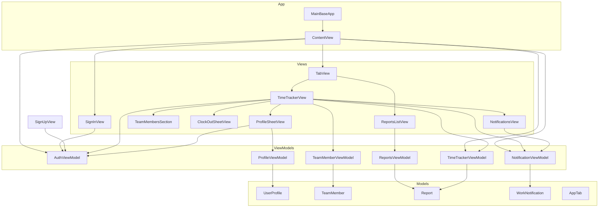
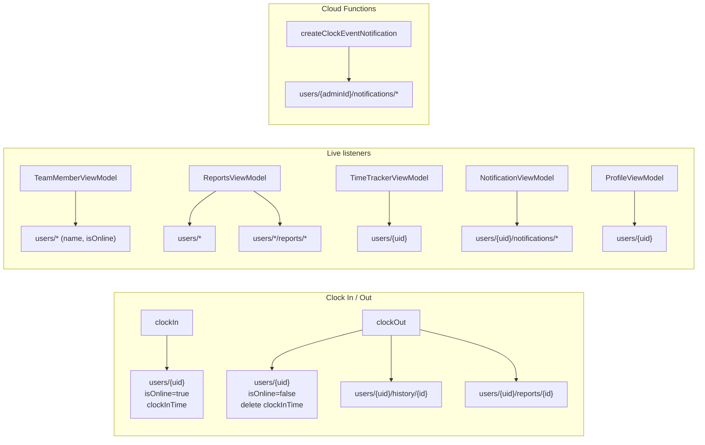

# MainBase

iOS app for team clock-in/out, shift reports, and notifications. Built with SwiftUI and Firebase.

---

<!-- DRAFT SECTIONS 1–13 — review and tell me which to keep, edit, or remove -->

## 1. Project overview

MainBase is a SwiftUI iOS app for distributed teams to track work sessions. Team members clock in and out, submit an end-of-shift report, and see who is currently online. A shared **Reports** tab aggregates shift summaries across the team. Admins receive in-app notifications (and push, via Cloud Functions) when someone clocks in or out.

**Primary users**
- **Team members** — clock in/out, write shift reports, view team status
- **Admins** — receive clock-event notifications; manage team data via web/mobile tools

---

## 2. Requirements

| Requirement | Version / notes |
|-------------|-----------------|
| macOS | Required for iOS development |
| Xcode | 15+ recommended (project uses SwiftPM + file-system synchronized groups) |
| iOS deployment target | **17.0** |
| Swift | 5.0 |
| Firebase iOS SDK | **12.15.0** (via Swift Package Manager) |
| Firebase products used | Auth, Firestore, Analytics, Messaging, Storage |
| Firebase project | Shared with `lacoachoffice` — credentials in `GoogleService-Info.plist` |

---

## 3. Setup

### Clone and open

```bash
git clone <repo-url>
cd MainBase
open MainBase.xcodeproj
```

### Firebase config

1. Ensure `MainBase/GoogleService-Info.plist` is present (bundled with the target).
2. If setting up a new environment, download a new plist from the [Firebase Console](https://console.firebase.google.com/) for your iOS app and replace the file.
3. Enable **Email/Password** authentication in Firebase Auth for the project.

### Run

1. Select the **MainBase** scheme.
2. Choose an iOS 17+ simulator or device.
3. Press **Run** (⌘R).

Xcode resolves Firebase dependencies automatically on first build via Swift Package Manager.

### First sign-in

Create an account via **Sign Up** on the auth screen, or use an existing user from the shared Firebase project.

---

## 4. Firebase / backend link

MainBase reads and writes to the same Firestore database as **lacoachoffice**. Backend configuration lives in the sibling repo folder:

| Resource | Location |
|----------|----------|
| Firestore security rules | `lacoachoffice/firestore.rules` |
| Cloud Functions (clock notifications, push) | `lacoachoffice/functions/` |
| RN app Firebase config | `lacoachoffice/config/firebase.ts` |

**Key Cloud Functions**
- `createClockEventNotification` — callable; writes clock-event docs to admin users’ `notifications` subcollections
- `sendClockEventPush` — Firestore trigger on `users/{uid}/notifications/{id}`; sends FCM/Expo push for `type: "clock_event"`

MainBase does **not** deploy rules or functions itself. Changes to schema or security rules should be made in `lacoachoffice` and deployed from there.

---

## 5. Running tests

### Unit tests

```bash
xcodebuild test \
  -scheme MainBase \
  -destination 'platform=iOS Simulator,name=iPhone 17' \
  -only-testing:MainBaseTests
```

Or in Xcode: **Product → Test** (⌘U) with the `MainBaseTests` target selected.

### UI tests

```bash
xcodebuild test \
  -scheme MainBase \
  -destination 'platform=iOS Simulator,name=iPhone 17' \
  -only-testing:MainBaseUITests
```

> **Note:** Test targets exist but coverage is minimal. Expand tests when adding ViewModels or Firestore logic.

---

## 6. Architecture conventions

MainBase follows **MVVM** with feature-grouped folders:

| Layer | Folder | Responsibility |
|-------|--------|----------------|
| Model | `Models/` | Plain structs/enums; Firestore mapping in `init(data:)` where needed |
| ViewModel | `ViewModel/` | `@MainActor` `ObservableObject`; Firebase listeners and mutations |
| View | `Views/<Feature>/` | SwiftUI UI only; no direct Firestore calls |
| Shared UI | `Components/` | Reusable form controls, logo, toggles |
| Helpers | `Utilities/` | Theme, view modifiers |

**When adding a feature**
1. Add or extend a model in `Models/`.
2. Create a ViewModel if the screen talks to Firebase or holds non-trivial state.
3. Place the view under `Views/<FeatureName>/`.
4. Wire shared ViewModels from `ContentView` via `@StateObject` + `.environmentObject()` when multiple tabs/sheets need them (e.g. `AuthViewModel`, `TimeTrackerViewModel`).
5. Use local `@StateObject` for ViewModels scoped to one screen (e.g. `ReportsViewModel` in `ReportsListView`).

**Naming**
- Views: `<Feature>View.swift`, `<Feature>SheetView.swift`
- ViewModels: `<Feature>ViewModel.swift`
- One primary type per file

---

## 7. Environment / secrets

| File | Purpose | Committed? |
|------|---------|------------|
| `MainBase/GoogleService-Info.plist` | Firebase iOS app config | Yes (currently in repo) |
| Firebase Auth users | Managed in Firebase Console | — |

**Recommendations**
- Treat `GoogleService-Info.plist` as sensitive in public repos — consider gitignoring it and documenting how to obtain a copy.
- Do not commit service account keys or Admin SDK JSON.
- All Firestore access is client-side with security rules; no API keys beyond the plist are required in the app.

---

## 8. Screens / navigation map

MainBase uses a tab bar after sign-in. No screenshots are checked in yet — add images to `docs/screenshots/` when available.

```
[Not signed in]
  SignInView
    └── SignUpView (push)

[Signed in — TabView]
  Tab 1: Clock In (TimeTrackerView)
    ├── Clock card (tap to clock in / open clock-out sheet)
    ├── TeamMembersSection (live online roster)
    ├── Profile sheet (avatar, top-left)
    └── Notifications sheet (bell, top-right)

  Tab 2: Reports (ReportsListView)
    └── Chronological feed of all users’ shift reports
```

**Tab behavior**
- Default tab on launch: **Clock In**
- If user is already clocked in on first load, app switches to **Reports** once

---

## 9. Auth flows

All auth logic lives in `AuthViewModel`. Firebase Auth state is observed on launch; `ContentView` reacts to `isSignedIn` and `currentUserId`.

| Flow | Entry | Behavior |
|------|-------|----------|
| **Sign in** | `SignInView` | Email + password → Firebase Auth; errors shown in alert |
| **Sign up** | `SignUpView` | Validates name, email, company, phone, password, terms → creates Firebase user → sets display name |
| **Forgot password** | Link on sign-in | Sends reset email to the email field value |
| **Sign out** | Profile sheet | `AuthViewModel.signOut()` → returns to sign-in |
| **Session restore** | App launch | Auth listener restores session if Firebase user persists |

**Not implemented in MainBase**
- Remember Me is UI-only (toggle does not persist session preference unlike lacoachoffice)
- Email change in profile (profile shows read-only email)
- OAuth / Apple Sign In

---

## 10. Push notifications

MainBase includes **FirebaseMessaging** but the iOS app does not yet register for or display system push banners directly in the codebase reviewed here. Push delivery is handled by the shared backend:

1. User clocks in/out → (optional) lacoachoffice calls `createClockEventNotification`
2. Cloud Function writes to `users/{adminId}/notifications/{id}`
3. `sendClockEventPush` trigger reads FCM/Expo tokens on the admin user doc and sends push

**In-app notifications**
- `NotificationViewModel` listens to `users/{currentUserId}/notifications`
- Shown in the bell sheet on the Clock In tab
- Supports **Mark all read**

Admins (`users.admin == true`) are the intended recipients of clock-event notifications.

---

## 11. Known limitations

- **Clock-out report required** — user must enter text before submitting clock out
- **History tab** — `users/{uid}/history` is written on clock out but not displayed in the UI yet
- **Reports feed** — shows all users’ reports; no filtering by date or person
- **Remember Me** — checkbox on sign-in is not wired to persistence
- **Sign-up profile fields** — company/phone collected on sign-up are not written to Firestore user doc (only display name is set via Auth profile)
- **Offline** — no explicit offline queue; Firestore calls may fail silently in some ViewModels
- **Admin features** — no admin-only UI in MainBase; admin workflows live in lacoachoffice

---

## 12. Recent changes

| Change | Summary |
|--------|---------|
| Tab bar redesign | **Clock In** + **Reports** tabs via `AppTab` |
| Reports tab | `ReportsListView` + `ReportsViewModel` — live feed from `users/*/reports` |
| Team roster | `TeamMembersSection` + `TeamMemberViewModel` on Clock In tab |
| MVVM refactor | Split into `Models/`, `ViewModel/`, `Views/`, `Components/`, `Utilities/` |
| Clock out | Writes both `history` and `reports` subcollections |

<!-- Replace with dated changelog entries as the project grows -->

---

## 13. Contributing

### Branch workflow

1. Branch from `main` (or the active feature branch, e.g. `ft/reports`)
2. Use descriptive branch names: `ft/<feature>`, `fix/<issue>`, `docs/<topic>`
3. Open a PR with a short summary and test plan

### Code style

- Match existing SwiftUI + MVVM patterns in this repo
- Keep views thin; move Firebase logic to ViewModels
- Prefer shared components in `Components/` over duplicating form UI
- Run a local build before pushing: `xcodebuild -scheme MainBase -destination 'platform=iOS Simulator,name=iPhone 17' build`

### Schema changes

If you add or rename Firestore fields:
1. Update the **Firestore data structure** section below
2. Update `lacoachoffice/firestore.rules` if access patterns change
3. Coordinate with Cloud Functions if notifications or push payloads change

---

<!-- END DRAFT SECTIONS -->

## MVVM file structure

```
MainBase/
├── MainBaseApp.swift                    ← App entry (Firebase init)
│
├── Models/
│   ├── AppTab.swift                     ← Tab enum (clockIn, reports)
│   ├── Report.swift                     ← Shift report list item
│   ├── TeamMember.swift                 ← Team roster item
│   ├── UserProfile.swift                ← Profile fields
│   └── WorkNotification.swift           ← In-app notification
│
├── ViewModel/
│   ├── AuthViewModel.swift              ← Sign in/up, auth state
│   ├── NotificationViewModel.swift      ← User notifications
│   ├── ProfileViewModel.swift           ← Load/save profile
│   ├── ReportsViewModel.swift           ← All users’ reports feed
│   ├── TeamMemberViewModel.swift        ← Team online status
│   └── TimeTrackerViewModel.swift       ← Clock in/out + history
│
├── Views/
│   ├── ContentView.swift                ← Root: auth gate + TabView
│   ├── Auth/
│   │   ├── SignInView.swift
│   │   └── SignUpView.swift
│   ├── TimeTracker/
│   │   ├── TimeTrackerView.swift        ← Clock In tab
│   │   ├── ClockOutSheetView.swift
│   │   └── TeamMembersSection.swift
│   ├── Reports/
│   │   └── ReportsListView.swift        ← Reports tab
│   ├── Notifications/
│   │   ├── NotificationsView.swift
│   │   └── WorkNotificationCard.swift
│   └── Profile/
│       └── ProfileSheetView.swift
│
├── Components/
│   ├── AppLogoView.swift
│   ├── CheckboxToggle.swift
│   ├── FormTextField.swift
│   └── SecureFormField.swift
│
└── Utilities/
    ├── Theme.swift                      ← AppColors
    └── View+InputFieldStyle.swift
```

### How layers connect



| Screen | ViewModel(s) | Model(s) |
|--------|--------------|----------|
| `ContentView` | `AuthViewModel`, `NotificationViewModel`, `TimeTrackerViewModel` | `AppTab` |
| Clock In tab | `TimeTrackerViewModel`, `TeamMemberViewModel`, `NotificationViewModel` | `TeamMember` |
| Reports tab | `ReportsViewModel` | `Report` |
| Profile sheet | `ProfileViewModel`, `AuthViewModel` | `UserProfile` |
| Notifications sheet | `NotificationViewModel` | `WorkNotification` |

## Firestore data structure

MainBase shares a Firebase backend with the lacoachoffice project. Below is what the iOS app reads/writes today, plus related fields the backend uses.

```
firestore/
└── users/  {userId}
    │
    ├── [user document fields]
    │   ├── name: string              ← Profile, team list, reports feed
    │   ├── email: string             ← Profile
    │   ├── company: string           ← Profile
    │   ├── phone: string             ← Profile
    │   ├── country: string           ← Profile
    │   ├── isOnline: bool            ← Clock in/out, team status
    │   ├── clockInTime: timestamp    ← Clock in/out, elapsed timer
    │   │
    │   ├── admin: bool               ← Backend only (clock-event notifications)
    │   ├── currentTask: string       ← Backend / other clients
    │   ├── createdAt: timestamp      ← Set on first user doc create
    │   ├── fcmToken / fcmTokens      ← Push (Cloud Functions)
    │   └── expoPushToken(s)          ← Push (Cloud Functions)
    │
    ├── history/  {historyId}         ← Written on clock out
    │   ├── clockIn: timestamp
    │   ├── clockOut: timestamp
    │   ├── durationMs: number
    │   ├── durationFormatted: string   e.g. "2h 15m"
    │   ├── report: string
    │   └── createdAt: timestamp
    │
    ├── reports/  {reportId}          ← Written on clock out (if report non-empty)
    │   ├── reportText: string
    │   └── timestamp: timestamp
    │
    ├── notifications/  {notificationId}  ← Created by Cloud Function for admins
    │   ├── type: string                e.g. "clock_event"
    │   ├── title: string
    │   ├── body: string
    │   ├── read: bool
    │   ├── action: string              "clock_in" | "clock_out"
    │   ├── actorUserId: string
    │   ├── actorName: string
    │   ├── recipientUserId: string
    │   └── createdAt: timestamp
    │
    ├── fcmTokens/  {tokenId}         ← Push infra (not used directly in iOS app)
    └── expoPushTokens/  {tokenId}    ← Push infra (not used directly in iOS app)
```

### Data flow by feature



### Collection summary

| Path | Written by MainBase | Read by |
|------|---------------------|---------|
| `users/{uid}` | Clock in/out, profile save | `TimeTrackerViewModel`, `ProfileViewModel`, `TeamMemberViewModel`, `ReportsViewModel` |
| `users/{uid}/history/{id}` | Clock out | Audit trail (not shown in current UI) |
| `users/{uid}/reports/{id}` | Clock out | `ReportsViewModel` → Reports tab |
| `users/{uid}/notifications/{id}` | Cloud Function | `NotificationViewModel` → bell sheet |
